# Franka RL Training Results

Extracted from the executed outputs of the three formal 500k-step notebooks.

## A — Distance-Layered

Source: `Franka_A_Formal500k_DistanceLayered_AutoDL_MuJoCo3_output.ipynb`

### Table 1

|  | timesteps | phase | success_rate | native_return | oracle_tanh_return | oracle_sparse_return | mean_final_distance | mean_min_distance |
| --- | --- | --- | --- | --- | --- | --- | --- | --- |
| 20 | 420000 | distance_layered | 0.95 | -7.710032 | 41.627854 | -7.20 | 0.023832 | 0.022688 |
| 21 | 440000 | distance_layered | 0.95 | -8.046266 | 40.705103 | -7.05 | 0.030585 | 0.029683 |
| 22 | 460000 | distance_layered | 0.95 | -14.667831 | 39.835289 | -13.60 | 0.034268 | 0.027208 |
| 23 | 480000 | distance_layered | 0.85 | -12.112450 | 40.846709 | -11.15 | 0.030820 | 0.026737 |
| 24 | 500000 | distance_layered | 1.00 | -5.301831 | 43.103906 | -4.80 | 0.017098 | 0.016633 |

### Figure 1

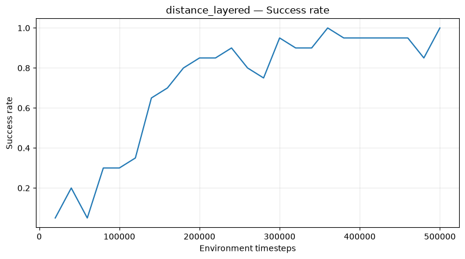

### Figure 2

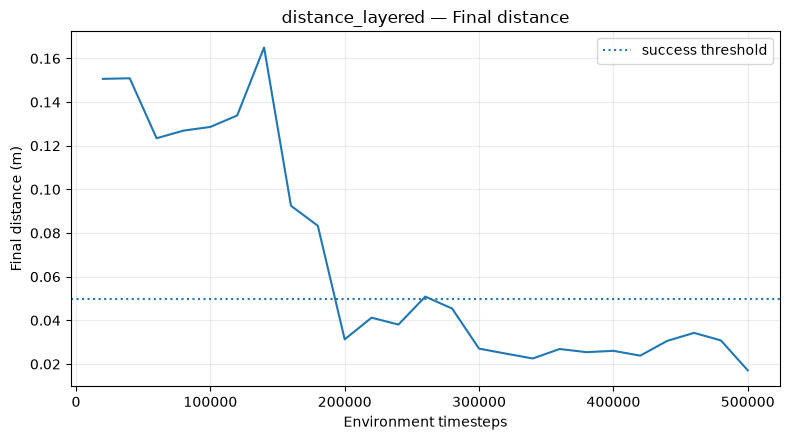

### Figure 3

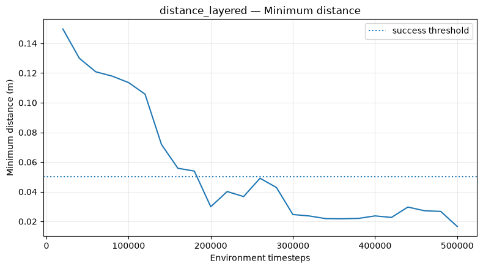

### Table 2

|  | episode | success | final_distance | min_distance | episode_length | native_return |
| --- | --- | --- | --- | --- | --- | --- |
| count | 100.000000 | 100.000000 | 100.000000 | 100.000000 | 100.0 | 100.000000 |
| mean | 49.500000 | 0.980000 | 0.020564 | 0.018139 | 50.0 | -7.358991 |
| std | 29.011492 | 0.140705 | 0.018989 | 0.014303 | 0.0 | 9.227995 |
| min | 0.000000 | 0.000000 | 0.003046 | 0.002934 | 50.0 | -51.383924 |
| 25% | 24.750000 | 1.000000 | 0.012882 | 0.011119 | 50.0 | -8.083366 |
| 50% | 49.500000 | 1.000000 | 0.015887 | 0.014957 | 50.0 | -4.539653 |
| 75% | 74.250000 | 1.000000 | 0.022535 | 0.020842 | 50.0 | -4.000000 |
| max | 99.000000 | 1.000000 | 0.131993 | 0.120752 | 50.0 | 0.000000 |

## B — Dense-to-Sparse

Source: `Franka_B_Formal500k_Dense2Sparse_AutoDL_MuJoCo3_output.ipynb`

### Table 1

|  | timesteps | phase | success_rate | native_return | oracle_tanh_return | oracle_sparse_return | mean_final_distance | mean_min_distance |
| --- | --- | --- | --- | --- | --- | --- | --- | --- |
| 20 | 420000 | sparse | 1.0 | -5.95 | 41.679811 | -5.95 | 0.021001 | 0.020549 |
| 21 | 440000 | sparse | 0.9 | -9.00 | 42.138982 | -9.00 | 0.022645 | 0.021352 |
| 22 | 460000 | sparse | 1.0 | -6.80 | 41.940825 | -6.80 | 0.023454 | 0.017673 |
| 23 | 480000 | sparse | 1.0 | -4.95 | 42.908561 | -4.95 | 0.018254 | 0.018071 |
| 24 | 500000 | sparse | 1.0 | -6.00 | 43.039960 | -6.00 | 0.015809 | 0.014892 |

### Figure 1

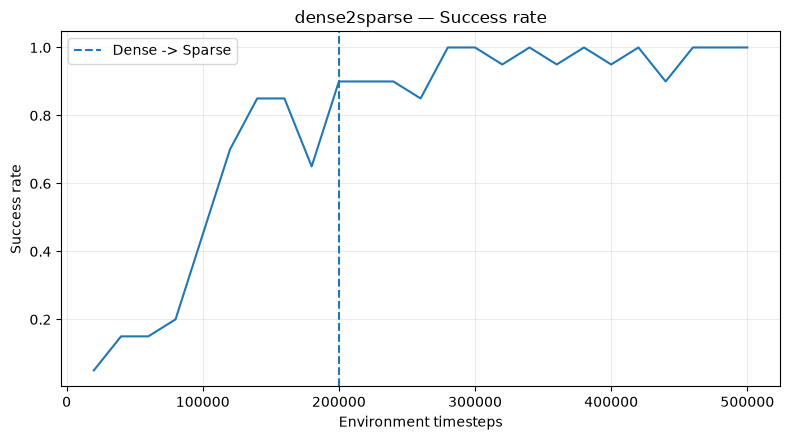

### Figure 2

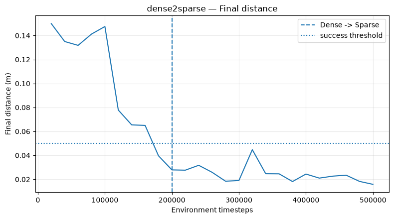

### Figure 3

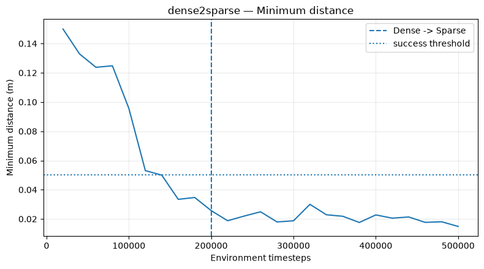

### Table 2

|  | episode | success | final_distance | min_distance | episode_length | native_return |
| --- | --- | --- | --- | --- | --- | --- |
| count | 100.000000 | 100.0 | 100.000000 | 100.000000 | 100.0 | 100.000000 |
| mean | 49.500000 | 1.0 | 0.018405 | 0.017849 | 50.0 | -4.840000 |
| std | 29.011492 | 0.0 | 0.008063 | 0.008124 | 0.0 | 3.416301 |
| min | 0.000000 | 1.0 | 0.002780 | 0.002594 | 50.0 | -25.000000 |
| 25% | 24.750000 | 1.0 | 0.012620 | 0.012034 | 50.0 | -6.000000 |
| 50% | 49.500000 | 1.0 | 0.018882 | 0.018063 | 50.0 | -4.000000 |
| 75% | 74.250000 | 1.0 | 0.022886 | 0.022675 | 50.0 | -4.000000 |
| max | 99.000000 | 1.0 | 0.043445 | 0.043445 | 50.0 | 0.000000 |

## C — Force Feedback

Source: `Franka_Advanced_ForceFeedback_SAC_HER_AutoDL_MuJoCo3_outpu.ipynb`

### Table 1

|  | timesteps | phase | success_rate | native_return | task_return | mean_final_distance | mean_min_distance | mean_force | max_force | contact_ratio | mean_action_delta |
| --- | --- | --- | --- | --- | --- | --- | --- | --- | --- | --- | --- |
| 5 | 120000 | distance_layered | 0.80 | -18.914152 | -18.914152 | 0.045228 | 0.041475 | 9.743315 | 4196.947266 | 0.024 | 0.581630 |
| 6 | 140000 | distance_layered | 0.95 | -13.957918 | -13.957918 | 0.030340 | 0.022922 | 26.520191 | 3540.608887 | 0.032 | 0.715801 |
| 7 | 160000 | distance_layered | 0.95 | -16.491629 | -16.491629 | 0.037273 | 0.021995 | 15.459346 | 3615.541260 | 0.030 | 0.690410 |
| 8 | 180000 | distance_layered | 0.90 | -10.719682 | -10.719682 | 0.035008 | 0.034296 | 1.452511 | 1414.751343 | 0.012 | 0.443550 |
| 9 | 200000 | distance_layered | 0.95 | -12.903754 | -12.903754 | 0.024873 | 0.021473 | 17.769261 | 4206.875000 | 0.034 | 0.573218 |
| 10 | 220000 | distance_layered | 0.90 | -12.214652 | -12.214652 | 0.024997 | 0.022002 | 14.055458 | 3967.328369 | 0.035 | 0.722603 |
| 11 | 240000 | distance_layered | 0.95 | -12.416032 | -12.416032 | 0.033242 | 0.024684 | 3.215839 | 1490.834717 | 0.023 | 0.706135 |
| 12 | 260000 | distance_layered | 0.95 | -10.855194 | -10.855194 | 0.021758 | 0.017574 | 28.535065 | 4632.354980 | 0.036 | 0.807259 |
| 13 | 280000 | distance_layered | 0.90 | -10.860374 | -10.860374 | 0.029379 | 0.028814 | 0.043364 | 4.513929 | 0.014 | 0.319680 |
| 14 | 300000 | distance_layered | 1.00 | -6.045236 | -6.045236 | 0.018886 | 0.018398 | 2.850103 | 1304.453003 | 0.022 | 0.461334 |
| 15 | 320000 | distance_layered | 0.95 | -9.573525 | -9.573525 | 0.022694 | 0.021112 | 6.992487 | 3991.279541 | 0.020 | 0.735161 |
| 16 | 340000 | distance_layered | 0.90 | -12.566268 | -12.566268 | 0.032625 | 0.032329 | 5.502697 | 1639.780518 | 0.022 | 0.554008 |
| 17 | 360000 | distance_layered | 0.95 | -10.025494 | -10.025494 | 0.021612 | 0.019899 | 0.070540 | 19.432730 | 0.016 | 0.465842 |
| 18 | 380000 | distance_layered | 0.95 | -8.620769 | -8.620769 | 0.023254 | 0.020022 | 22.760872 | 4843.284180 | 0.035 | 0.527156 |
| 19 | 400000 | distance_layered | 0.95 | -8.563422 | -8.563422 | 0.019468 | 0.019052 | 3.056806 | 1836.890747 | 0.019 | 0.519519 |
| 20 | 420000 | distance_layered | 0.90 | -10.026689 | -10.026689 | 0.030017 | 0.024578 | 9.138929 | 2667.586670 | 0.035 | 0.591743 |
| 21 | 440000 | distance_layered | 1.00 | -8.935787 | -8.935787 | 0.020967 | 0.018208 | 6.176076 | 3893.897461 | 0.017 | 0.449716 |
| 22 | 460000 | distance_layered | 0.90 | -10.555227 | -10.555227 | 0.026126 | 0.025487 | 11.039810 | 5075.235352 | 0.021 | 0.501814 |
| 23 | 480000 | distance_layered | 0.95 | -7.520866 | -7.520866 | 0.022653 | 0.021993 | 2.052219 | 1011.743286 | 0.017 | 0.480981 |
| 24 | 500000 | distance_layered | 1.00 | -5.322419 | -5.322419 | 0.016780 | 0.016570 | 9.893808 | 3474.332031 | 0.027 | 0.804024 |

### Figure 1

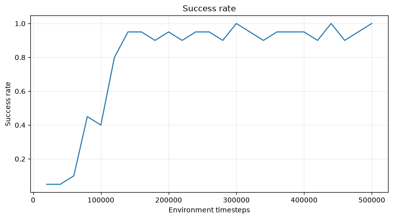

### Figure 2

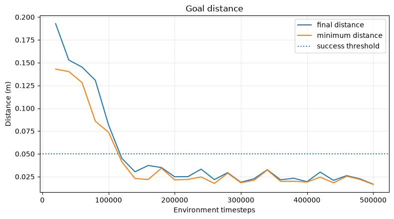

### Figure 3

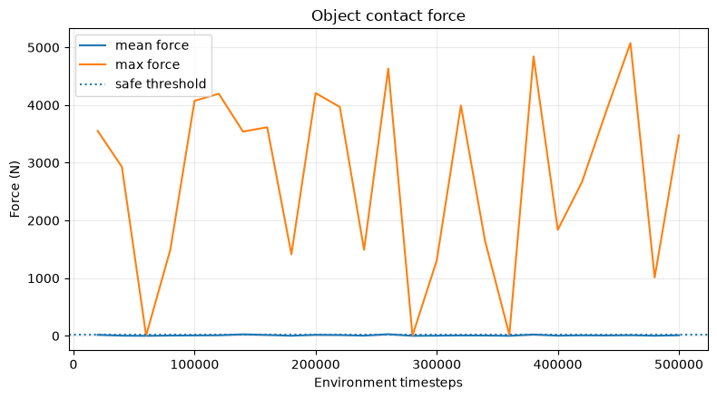

### Figure 4

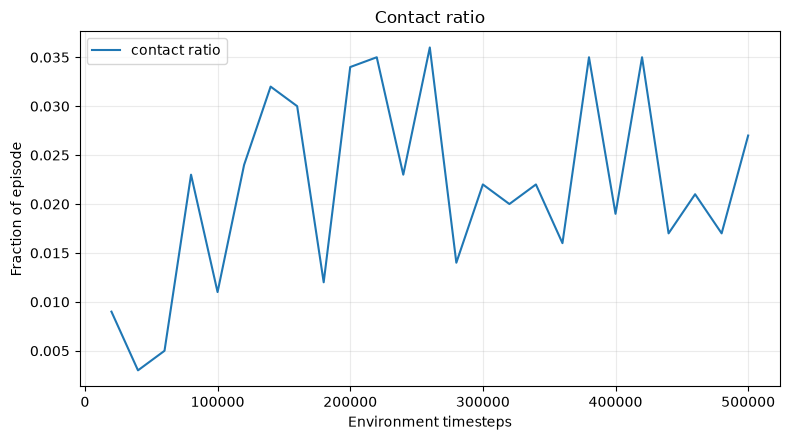

### Figure 5

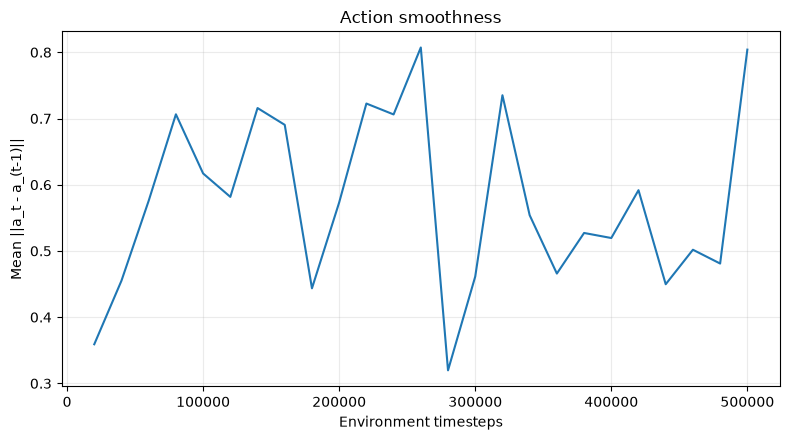

### Table 2

|  | episode | success | final_distance | min_distance | native_return | task_return | mean_force | max_force | contact_ratio | mean_action_delta |
| --- | --- | --- | --- | --- | --- | --- | --- | --- | --- | --- |
| count | 100.000000 | 100.000000 | 100.000000 | 100.000000 | 100.000000 | 100.000000 | 100.000000 | 100.000000 | 100.000000 | 100.000000 |
| mean | 49.500000 | 0.960000 | 0.024333 | 0.021534 | -8.460650 | -8.460650 | 22.884017 | 333.312086 | 0.029600 | 0.770997 |
| std | 29.011492 | 0.196946 | 0.026886 | 0.020702 | 11.739676 | 11.739676 | 113.977293 | 1096.578258 | 0.057312 | 0.495696 |
| min | 0.000000 | 0.000000 | 0.002460 | 0.002460 | -58.876524 | -58.876524 | 0.000000 | 0.000000 | 0.000000 | 0.086094 |
| 25% | 24.750000 | 1.000000 | 0.012363 | 0.011581 | -8.214797 | -8.214797 | 0.000000 | 0.000000 | 0.000000 | 0.368806 |
| 50% | 49.500000 | 1.000000 | 0.018976 | 0.018481 | -5.000000 | -5.000000 | 0.055313 | 2.524539 | 0.020000 | 0.682696 |
| 75% | 74.250000 | 1.000000 | 0.025999 | 0.022988 | -4.000000 | -4.000000 | 0.141275 | 4.299579 | 0.040000 | 1.094057 |
| max | 99.000000 | 1.000000 | 0.195391 | 0.151809 | 0.000000 | 0.000000 | 790.361666 | 5183.168945 | 0.360000 | 2.448040 |
